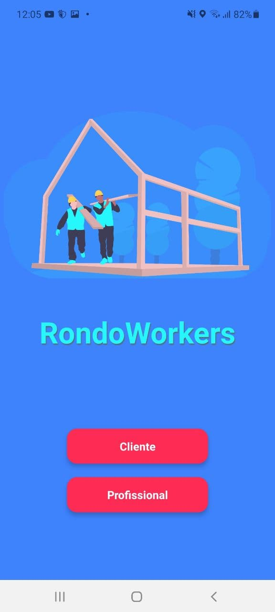
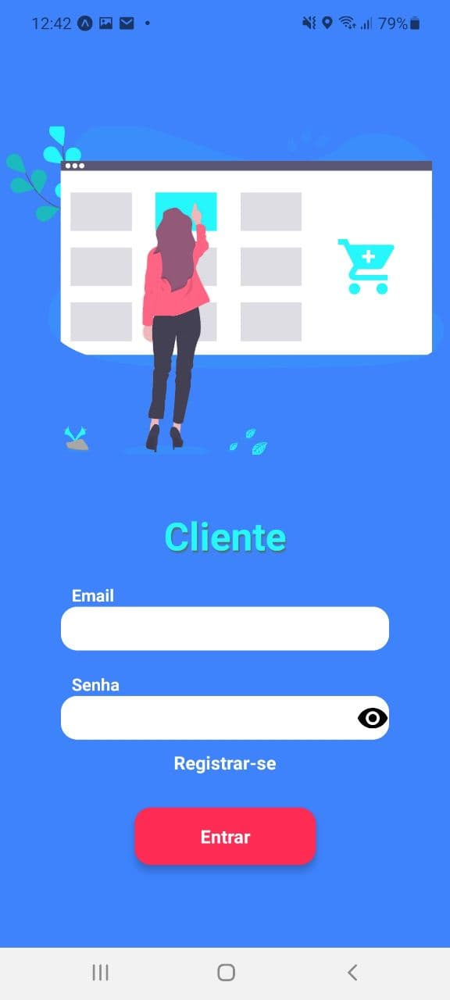
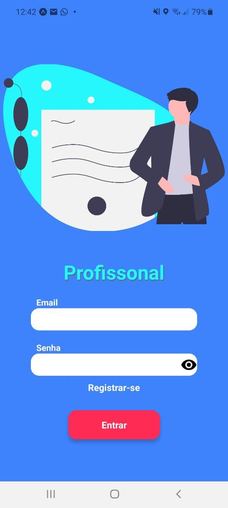

# RondoWorker Application

Application for client interaction with professional making the hiring by a "click" 
The application's proposal is to make it easier for customers to find the best professional for that service

  

    <h3>Main Screen</h3>
    
    
screen to choose to enter/register a client or professional

  

  

    <h3>Client Screen</h3>
    
    
screen for the user to enter / register as a customer

  

  

    <h3>Profissional Screen</h3>
    
    
screen for the user to enter / register as a Profissional

  

